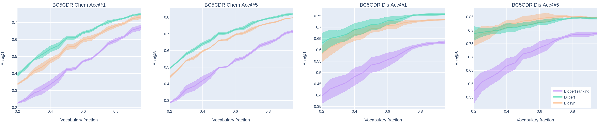

Medical Concept Normalization in Clinical Trials with Drug and Disease Representation Learning
---
This repository contains additional materials of our papers ["Medical Concept Normalization in Clinical Trials with Drug and Disease Representation Learning"](https://academic.oup.com/bioinformatics/advance-article/doi/10.1093/bioinformatics/btab474/6313159?login=true) (_Bioinformatics_) and ["Drug and Disease Interpretation Learning with Biomedical Entity Representation Transformer"](https://link.springer.com/chapter/10.1007/978-3-030-72113-8_30) (_ECIR 2021_). 
We investigate the effectiveness of transferring concept normalization from the general biomedical domain to the 
clinical trials domain in a zero-shot setting with an absence of labeled data. We propose a simple and effective 
two-stage neural approach based on fine-tuned BERT architectures. In the first stage, we train a metric learning model 
that optimizes relative similarity of mentions and concepts via triplet loss. The model is trained on available labeled 
corpora of scientific abstracts to obtain vector embeddings of concept names and entity mentions from texts. In the 
second stage, we find the closest concept name representation in an embedding space to a given clinical mention. We 
evaluated several models, including state-of-the-art architectures, on a dataset of abstracts and a real-world dataset
 of trial records with interventions and conditions mapped to drug and disease terminologies. Extensive experiments
  validate the effectiveness of our approach in knowledge transfer from the scientific literature to clinical trials.
  
Evaluation & Results
---
Table 1
Out-of-domain performance of the proposed DILBERT model andbaselines in terms of Acc@1 on the 
filtered test set of clinical trials (CT)

<table>
<thead>
  <tr>
    <th rowspan="2">Model</th>
    <th colspan="2">CT Condition</th>
    <th colspan="2">CT Intervention</th>
  </tr>
  <tr>
    <td>single concept</td>
    <td>full set</td>
    <td>single concept</td>
    <td>full set</td>
  </tr>
</thead>
<tbody>
  <tr>
    <td>BioBERT ranking</td>
    <td>72.6</td>
    <td>71.74</td>
    <td>77.83</td>
    <td>56.97</td>
  </tr>
  <tr>
    <td>BioSyn</td>
    <td>86.36</td>
    <td>-</td>
    <td>79.58</td>
    <td>-</td>
  </tr>
  <tr>
    <td colspan="5">DILBERT with different ranking strategies</td>
  </tr>
  <tr>
    <td>random sampling</td>
    <td>85.73</td>
    <td>84.85</td>
    <td>82.54</td>
    <td>81.16</td>
  </tr>
  <tr>
    <td>random + 2 parents</td>
    <td>86.74</td>
    <td>86.36</td>
    <td>81.84</td>
    <td>79.14</td>
  </tr>
  <tr>
    <td>random + 5 parents</td>
    <td>87.12</td>
    <td>86.74</td>
    <td>81.67</td>
    <td>79.14</td>
  </tr>
  <tr>
    <td>resampling</td>
    <td>85.22</td>
    <td>84.63</td>
    <td>81.67</td>
    <td>80.21</td>
  </tr>
  <tr>
    <td>resampling + 5 siblings</td>
    <td>84.84</td>
    <td>84.26</td>
    <td>80.62</td>
    <td>76.16</td>
  </tr>
</tbody>
</table>

Table 2
In-domain performance of the proposed DILBERT model interms of Acc@1 on the refined test set of 
the Biocreative V CDR corpus. For more details about the refined CDR corpus, please see our paper ["Fair evaluation in concept normalization: a large-scale comparative analysis for BERT-based models"](https://www.aclweb.org/anthology/2020.coling-main.588.pdf)

<table>
<thead>
  <tr>
    <th>Model</th>
    <th>CDR Disease</th>
    <th>CDR Chemical</th>
  </tr>
</thead>
<tbody>
  <tr>
    <td>BioBERT ranking</td>
    <td>66.4</td>
    <td>80.7</td>
  </tr>
  <tr>
    <td>BioSyn</td>
    <td>74.1</td>
    <td>83.8</td>
  </tr>
  <tr>
    <td>DILBERT, random sampling</td>
    <td>75.5</td>
    <td>81.4</td>
  </tr>
  <tr>
    <td>DILBERT, random + 2 parents</td>
    <td>75.0</td>
    <td>81.2</td>
  </tr>
  <tr>
    <td>DILBERT, random + 5 parents</td>
    <td>73.5</td>
    <td>81.4</td>
  </tr>
  <tr>
    <td>DILBERT, resampling</td>
    <td>75.8</td>
    <td>83.3</td>
  </tr>
  <tr>
    <td>DILBERT, resampling + 5 siblings</td>
    <td>75.3</td>
    <td>82.1</td>
  </tr>
</tbody>
</table>
  
 Figure 1
 In-domain performance  of the proposed DILBERT model in terms of Acc@1 on the refined test set of the Biocreative V 
 CDR corpus using reduced dictionaries.
 
 
 ## Requirements
```bash
$ pip install -r requirements.txt
```

## Resources

### Pretrained Model
We use the [Huggingface](https://github.com/huggingface/transformers) version of [BioBERT v1.1](https://github.com/dmis-lab/biobert) so that the pretrained model can be run on the pytorch framework.

- [biobert v1.1 (pytorch)](https://drive.google.com/drive/folders/1nSjj-ubecQbwYPdz3NyAqiJ1-rLtguUp?usp=sharing)

 ### Datasets

We made available all [datasets](https://yadi.sk/d/lQ8bAhFMnjSvTA)


### Run

To run the full training and evaluation procedure use run.sh script.

```bash
$ ./run.sh
```

## Generating triplets

```bash
$ python data_utils/convert_to_triplet_dataset.py --input_data path/to/labeled/files \
                                     --vocab path/to/vocabulary \
                                     --save_to path/to/save/triplets/file \
                                     --path_to_bert_model path/to/bert/model \
                                     --hard \
                                     --hierarchy path/to/hierarchy/file \
                                     --hierarchy_aware
```

## Train
```bash
$ python train_sentence_bert.py --path_to_bert_model path/to/bert/model \
                                --data_folder path/to/folder/containing/triplet/file  \
                                --triplets_file triplet_file_name \
                                --output_dir path/to/save/model
```

## Evaluation
 
To eval the model run the command:

```bash
$ python eval_bert_ranking.py --model_dir path/to/bert/model \
                         --data_folder path/to/labeled/files \
                         --vocab path/to/vocabulary

```

 
 
 Citing & Authors
 ---
Miftahutdinov Z., Kadurin A., Kudrin R., Tutubalina E. Drug and Disease Interpretation Learning with Biomedical Entity Representation Transformer //Advances in  Information Retrieval. – 2021. – pp. 451-466. [paper](https://link.springer.com/chapter/10.1007/978-3-030-72113-8_30), [preprint](https://arxiv.org/pdf/2101.09311.pdf)
```
@InProceedings{10.1007/978-3-030-72113-8_30,
 author="Miftahutdinov, Zulfat and Kadurin, Artur and Kudrin, Roman and Tutubalina, Elena",
 title="Drug and Disease Interpretation Learning with Biomedical Entity Representation Transformer",
 booktitle="Advances in  Information Retrieval",
 year="2021",
 publisher="Springer International Publishing",
 address="Cham",
 pages="451--466",
 isbn="978-3-030-72113-8"
}
```
Miftahutdinov Z., Kadurin A., Kudrin R., Tutubalina E. Medical concept normalization in clinical trials with drug and disease representation learning //Bioinformatics. – 2021. – Т. 37. – №. 21. – pp. 3856-3864. [paper](https://academic.oup.com/bioinformatics/article/37/21/3856/6313159)
```
@article{10.1093/bioinformatics/btab474,
    author = {Miftahutdinov, Zulfat and Kadurin, Artur and Kudrin, Roman and Tutubalina, Elena},
    title = "{Medical concept normalization in clinical trials with drug and disease representation learning}",
    journal = {Bioinformatics},
    volume = {37},
    number = {21},
    pages = {3856-3864},
    year = {2021},
    month = {07},
    issn = {1367-4803},
    doi = {10.1093/bioinformatics/btab474},
    url = {https://doi.org/10.1093/bioinformatics/btab474},
    eprint = {https://academic.oup.com/bioinformatics/article-pdf/37/21/3856/41091512/btab474.pdf},
}
```

Tutubalina E., Kadurin A., Miftahutdinov Z. Fair evaluation in concept normalization: a large-scale comparative analysis for BERT-based models //Proceedings of the 28th International Conference on Computational Linguistics. – 2020. – pp. 6710-6716. [paper](https://www.aclweb.org/anthology/2020.coling-main.588.pdf), [git](https://github.com/insilicomedicine/Fair-Evaluation-BERT)
```
@inproceedings{tutubalina2020fair,
  title={Fair evaluation in concept normalization: a large-scale comparative analysis for BERT-based models},
  author={Tutubalina, Elena and Kadurin, Artur and Miftahutdinov, Zulfat},
  booktitle={Proceedings of the 28th International Conference on Computational Linguistics},
  pages={6710--6716},
  year={2020}
}
```
